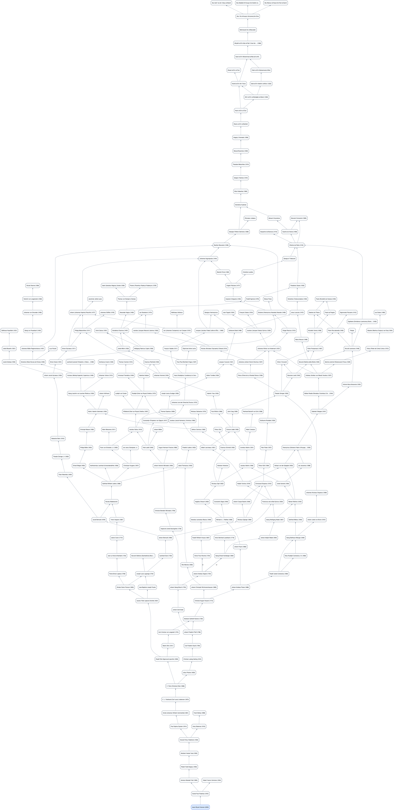

# mgp-ancestry

Math Genealogy Project ancestry tree generator.

This repository is a reusable CLI tool: start from any MGP ID and traverse upward through all listed advisors.

## Quickstart

```sh
uv sync --group dev
source .venv/bin/activate
mgp-ancestry build <start_id>
```

Key options:

```sh
mgp-ancestry build <start_id> \
  --max-depth 20 \
  --max-nodes 500 \
  --stop-id 2185 \
  --stop-name "Carl Friedrich Gauß"
```

Traversal direction is upward-only: person to all listed advisors.

See all options:

```sh
mgp-ancestry build --help
```

## Example Output

Sample full-depth Graphviz output for start ID `281144`:

- `docs/examples/lineage_281144.svg`
- `docs/examples/lineage_281144.png`



## Visualization

Export an existing lineage JSON into Gephi-friendly formats:

```sh
mgp-ancestry export-gephi out/lineage_<start_id>.json
```

```sh
make viz-graphviz INPUT=out/lineage_<start_id>.json ID=<start_id> FORMAT=png
```

See all export options:

```sh
mgp-ancestry export-gephi --help
```

## Attribution and Non-Affiliation

- This project consumes publicly available MGP web pages for research tooling.
- It is not affiliated with The Mathematics Genealogy Project.
- Users should respect source-site policies and conservative crawl-delay settings.

## For Contributors

Developer details are in [DEVELOPING.md](DEVELOPING.md).
